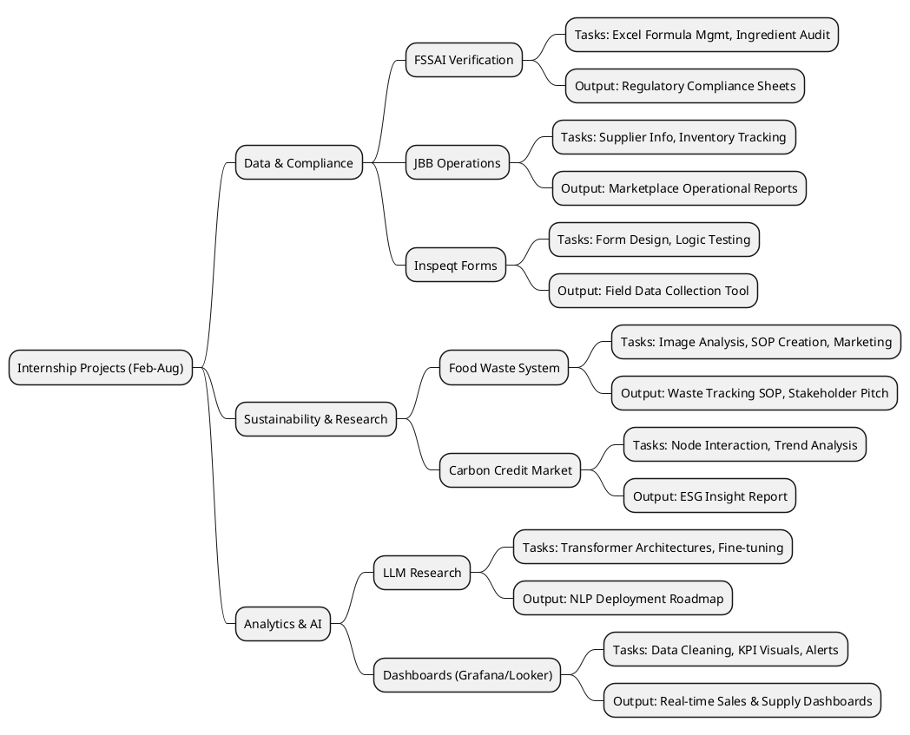
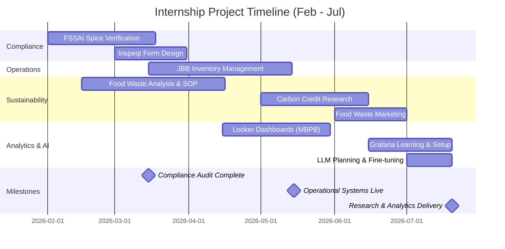

# Agnext Internship Project Portfolio (Feb - Aug 2026)

## Project Overview

This document outlines a comprehensive 6-month internship program spanning multiple domains including regulatory compliance, supply chain operations, sustainability initiatives, and advanced analytics. The portfolio encompasses 9 key projects organized into 4 strategic areas, with deliverables ranging from compliance automation to AI-driven insights and real-time operational dashboards.

**Timeline:** February 2026 - August 2026  
**Key Focus Areas:** Data & Compliance | Operations & Supply Chain | Sustainability & ESG | Analytics & AI

---

