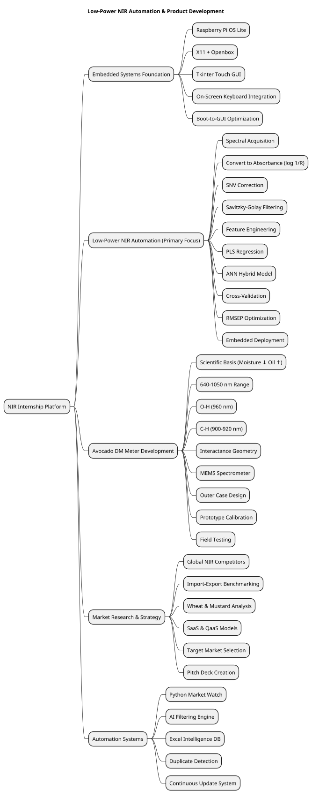
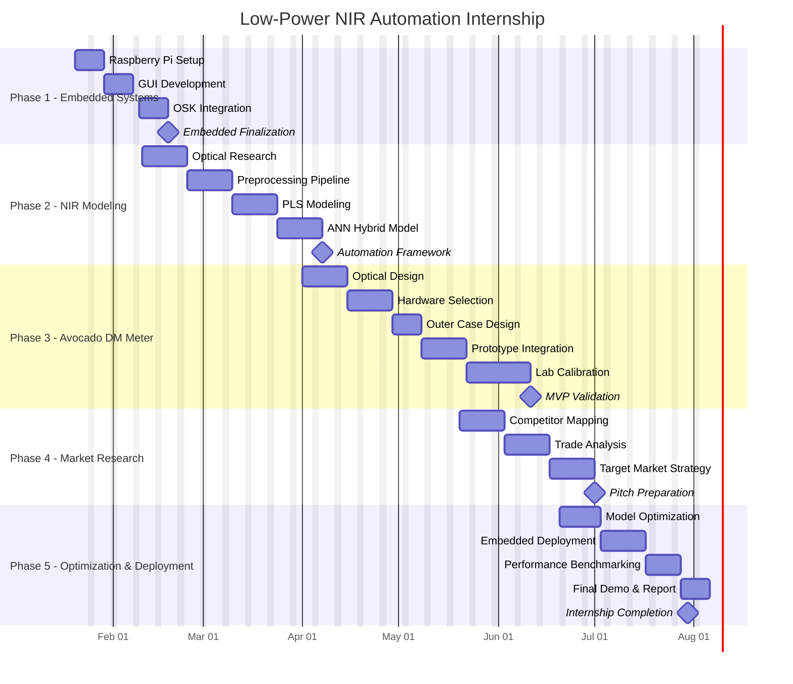

# Low-Power NIR Automation & Product Development Platform

---

## Internship Technical Report (6 Months)

**Intern:** Dhairya Ahuja  
**Duration:** January 2026 – July 2026  
**Primary Focus:** Automation & Modeling on Low-Power NIR Devices  
**Secondary Track:** Avocado Dry Matter Meter (Full Product Lifecycle)  
**Additional Track:** Market Research & Target Strategy  

---

# Project Description

This internship focuses on developing a **low-power Near-Infrared (NIR) sensing ecosystem**, integrating:

- Embedded system configuration
- Spectral preprocessing automation
- Hybrid chemometric modeling (PLS + ANN)
- Low-power model deployment
- Avocado Dry Matter (DM) device development
- Structured global market research
- Product positioning & pitch preparation

The goal is to create a **hardware-to-software NIR product framework** capable of moving from sensor-level acquisition to market-ready product strategy.

---

# Mindmap

## Internship Gantt Chart (6 Months)

