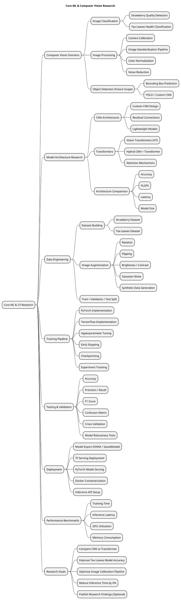
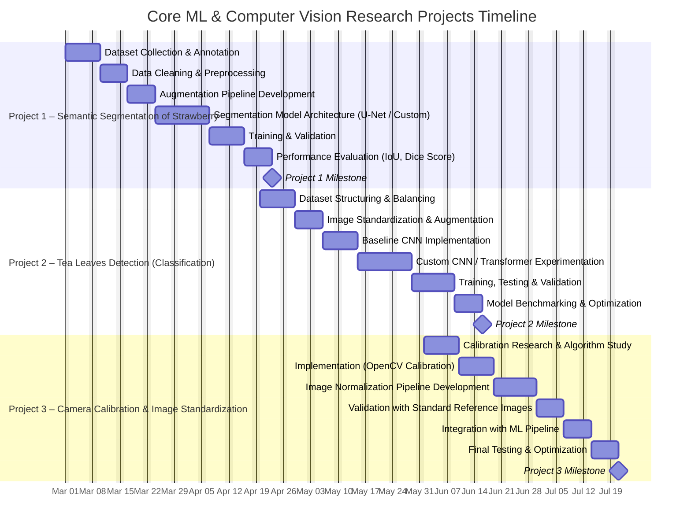

# **Core ML & Computer Vision Research**

---

## **Project Description**

This project delivers a **research-driven Computer Vision and Deep Learning platform** focused on:

- Model architecture experimentation  
- Image processing standardization  
- Custom model development  
- Deployment pipelines using **PyTorch** and **TensorFlow Serving**

The platform supports the complete lifecycle:

- Data Collection  
- Image Augmentation  
- Model Architecture Research  
- Training  
- Validation  
- Testing  
- Performance Benchmarking  
- Deployment  
- Monitoring  

The primary objective is to build **high-performance, production-ready computer vision models** while conducting structured research on **custom CNN architectures and transformer-based vision models**.

---

## Core ML & Computer Vision Research

---

### **Projects Summary**

| **Attribute** | **Detail** |
|---------------|------------|
| **Project Duration** | 20 weeks (2026-03-01 to 2026-07-20) |
| **Objective** | Build a research-driven CV pipeline with custom architectures, transformer exploration, image calibration processing, and production-grade deployment. |
| **Key Deliverables** | Dataset pipelines · Custom CNN architectures · Transformer experimentation · Camera calibration system · Training & testing pipeline · Deployment via TF Serving · Final research report & demo |

